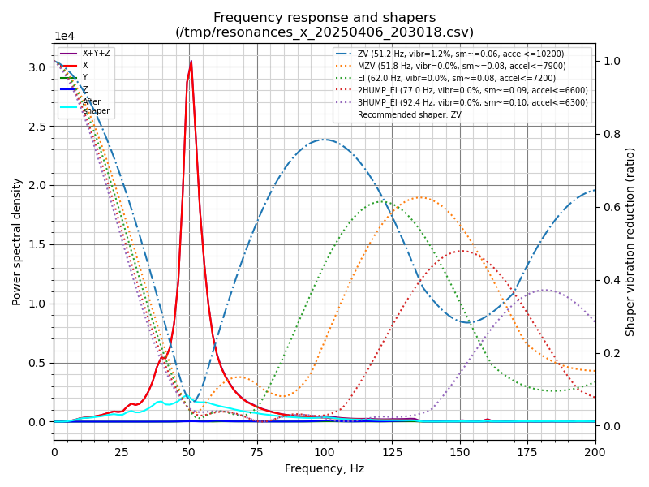
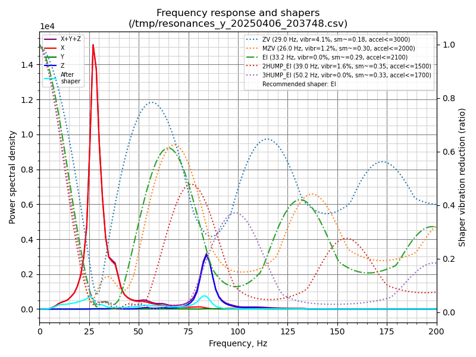

# SV01Chronicles

This is a logbook for my SV01 printer thinkering.
If you somehow stumble upon this feel free to look around and reach out.

> [!WARNING] 
> This is **not** a guide, just some notes for myself to replicate the setup and remember what I've done to this poor machine.

## Hardware stuff
### All metal hot end
I installed a TriangleLabs V6 plated copper hot end following [this](https://youtu.be/IrHVTM04Ivc) great tutorial.
I chamfered a bit the inside of the heat-break on the heatsink side since the filament tended to get stuck when exiting the PTFE tube. 

### Auto bed leveling
Installed a bl touch with [this](https://www.thingiverse.com/thing:4090150) mount printed in PET, securing the probe with m2 heat inserts and screws.

### Magnetic PEI print surface
This gives great adhesion and release, but limits the max temp of the bed from 110C to roughly 80C, depending how much you want to risk it.

### Minor tune-ups
Swapped the belts for proper Gates 6mm ones.  
Swapped v-slot wheels since they were a bit rough.  
Re-squared the frame.  

## Klipper stuff
I'm using RPI OS running on a raspberry pi 3B+

### Config file
There is a config file available for the SV01 directly in the main klipper repository [here](https://raw.githubusercontent.com/Klipper3d/klipper/refs/heads/master/config/printer-sovol-sv01-2020.cfg) which I used as the starting point.

### Kiauh

```bash
sudo apt-get update && sudo apt-get install git -y
```
```bash
cd ~ && git clone https://github.com/dw-0/kiauh.git
```
```bash
./kiauh/kiauh.sh
```
Now follow the instructions and install Klipper, Moonraker and Mainsail.

### Flashing the firmware
```bash
cd ~/klipper/
make menuconfig
```
Select Atmega AVR and atmega2560 then press Q and Y
```bash
make
```
Now determine the serial port
```bash
ls /dev/serial/by-id/*
```
Flash the firmware
```bash
sudo service klipper stop
make flash FLASH_DEVICE=<serial port>
sudo service klipper start
```
After a power cycle the screen should be blank (for now).

### Klipper config
Copy [printer.cfg](https://github.com/wandering-nora/SV01Chronicles/blob/main/printer.cfg) to ~/printer_data/config/printer.cfg.

Now run
```bash
ls /dev/serial/by-id/*
```
Update the printer.cfg file
```
[mcu]
serial: <id found>
```
After verifying [basic functionality](https://www.klipper3d.org/Config_checks.html)  pid tune the hot end and bed
```
PID_CALIBRATE HEATER=extruder TARGET=170
SAVE_CONFIG
PID_CALIBRATE HEATER=heater_bed TARGET=60
SAVE_CONFIG
```

### Bed leveling
Calibrate the probe x and y offset by running
```
PROBE
GET_POSITION
```
Mark on the build plate the probe's position and move the nozzle over it

```
GET_POSITION
```
The X and Y coordinates from the last two commands will be the probe and nozzle position respectively. Now calculate the offset and apply it to printer.cfg
```
[bltouch]
x_offset: <x nozzle - x probe>
y_offset: <y nozzle - y probe>
```
Then home the printer and adjust the z offset with a piece of paper and run
```
PROBE_CALIBRATE
```

In the webgui you can now visualize how your bed is almost as warped as your personality!

### Extruder calibration
Now it's time to calibrate the extruder following these steps
1. Heat up the nozzle and mark the filament ~70mm from the intake
2. Measure the actual distance with calipers <initial_mark_distance>
3. Extrude 50mm
   
   ```
   G91
   G1 E50 F60
   ```
5. Measure new distance between mark and intake <final_mark_distance>
6. actual_extrude_distance = <initial_mark_distance> - <final_mark_distance>
7. rotation_distance = <old_rotation_distance> * <actual_extrude_distance> / 50
8. round to 3 decimal places and update the config file
   
   ```
   [extruder]
   rotation_distance: <rotation_distance>
   ```

### Input shaping
#### USB-C (Default in config)
I recommend using a Mellow Fly style USB-C RP2040 ADXL345 accelerometer, the convenience is worth it.  
Build the firmware for the RP2040
```
cd ~/klipper
make clean
make menuconfig
```
Connect it while holding down the boot button and flash it
```
make flash FLASH_DEVICE=first
```
> If this fails just swap "first" with the device id
 
Now update the config with the right serial id.

#### SPI

If you still want to use an ADXL345 accelerometer connected to the rpi via SPI then setup the pi to act as a secondary mcu
```
cd ~/klipper/
sudo cp ./scripts/klipper-mcu.service /etc/systemd/system/
sudo systemctl enable klipper-mcu.service
```

```
make menuconfig
```
Select "linux process" as the arch then Q and Y, then flash
```
sudo service klipper stop
make flash
sudo service klipper start
```
Enable SPI
```
sudo raspi-config
```
Connect the accelerometer to the pi, keep it short or you may get too much interference.
```
VCC -> 3V3    (1)  
GND -> GND    (6)  
CS  -> GPIO8  (24)  
SDO -> GPIO9  (21)  
SDA -> GPIO10 (19)  
SCL -> GPIO11 (23)  
```
#### Measuring resonances

Install needed packages
```
sudo apt update
sudo apt install python3-numpy python3-matplotlib libatlas-base-dev libopenblas-dev
```
Install numpy
```
~/klippy-env/bin/pip install -v "numpy<1.26"
```

Now mount the accelerometer to the extruder (there is an unused hole in the top) using a plastic m3 screw and nut.

Test the accelerometer
```
ACCELEROMETER_QUERY
```
Then make sure the noise is not too high (at most in the hundreds)
```
MEASURE_AXES_NOISE
```
If everything is okay measure the X axis resonance
```
TEST_RESONANCES AXIS=X
```
For the Y axis print [this](https://www.printables.com/model/741237-mellow-fly-adxl345-accelerometer-mounts-for-sidewi/files) model and make sure to keep the bed heated up after the print finishes.  
Now just screw in the board and measure the resonance
```
TEST_RESONANCES AXIS=Y
```
Then generate your graphs and values
```
~/klipper/scripts/calibrate_shaper.py /tmp/resonances_x_*.csv -o /tmp/shaper_calibrate_x.png
~/klipper/scripts/calibrate_shaper.py /tmp/resonances_y_*.csv -o /tmp/shaper_calibrate_y.png
```

<p align="center">
  
  &nbsp;&nbsp;&nbsp;&nbsp;
   
</p>

Update the config file for input shaper
```
[input_shaper]
shaper_freq_x: <suggested value>
shaper_type_x: <suggested type>
shaper_freq_y: <suggested value>
shaper_type_y: <suggested type>
```
And for max acceleration
```
[printer
max_accel: <discussed later, go with what's recommended for now>
```

### Fine tuning Z offset
Fine-tune the Z offset with this [awesome guide.](https://ellis3dp.com/Print-Tuning-Guide/articles/first_layer_squish.html)
Or just fine-tune the offset in 0.01 intervals with [this](https://www.printables.com/model/251587-stress-free-first-layer-calibration-in-less-than-5) model.

### Pressure advance
Now it's time to fix those corners. Once again we're going to use [ellis' tool.](https://ellis3dp.com/Pressure_Linear_Advance_Tool/)  
You can use the G-code [here](). (210C extruder 60C bed)
Pick the sharpest corner that isn't too rounded and update the config
```
[extruder]
pressure_advance: <chosen value>
```

### Webcam
I added an USB webcam to monitor my prints. To get it to work all that's needed is
```
cd ~
git clone https://github.com/mainsail-crew/crowsnest.git
cd ~/crowsnest
sudo make install
```

## Slicer setup
### OrcaSlicer

### Cura
For cura you can just use the existing SV01 preset and change the start and end G-code. Using macros they will be

Start G-code
```
START_PRINT BED_TEMP={material_bed_temperature_layer_0} EXTRUDER_TEMP={material_print_temperature_layer_0}
```
End G-code
```
END_PRINT
```
> macros cannot be stopped, so if you need you can move the G-code from the printer.cfg macros directly into cura.

Disable acceleration control, jerk control and coasting.  

You can use the plugin "Moonraker connection" to send the gcode directly to klipper.  
Manage printers -> Connect Moonraker -> and enter your pi's ip.  

> if cura takes a long time to load STL files on linux disable the plugin "USB Printing"


### Extruder multiplier

### Retraction

### Max flow rate

### Improving cooling

### Belt tensioning

