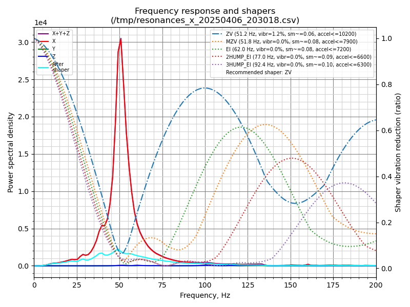

# SV01Chronicles

> [!IMPORTANT]  
> Very WIP

This is a logbook for my SV01 printer thinkering.
If you somehow stumble upon this feel free to look around and reach out.

> [!WARNING] 
> I am a beginner and I definitely make mistakes. This is **not** a guide, just some notes for myself to replicate the setup. Make sure to read klipper's [documentation](https://www.klipper3d.org/Installation.html).

The Sovol SV01 is a nice little machine, but the time has come to give it a glow up with Klipper to increase print quality and speed.
My machine is stock apart from a couple upgrades:

### All metal hot end
I installed a TriangleLabs V6 plated copper hot end following [this](https://youtu.be/IrHVTM04Ivc?si=vAyz9BuilHrvBVQR) great tutorial, which now allows me to print up to 290C. (or 500C with a thermistor swap according to the manufacturer)

### Auto bed leveling
I installed a cr touch, which was the best cheap upgrade I did.

### New firmware
I upgraded the printer to Marlin 2.0 building it from [coptertec's](https://www.coptertec.de/blogs/news/marlin-2-0-for-sovol-sv01) source. This is irrelevant for Klipper since it will be replaced.

# Klipper
I am installing klipper on a raspberry pi 3B+. I decided to go with Mainsail, but everything else should work for Fluidd and Octoprint as well.

## Config file
There is a config file available for the SV01 directly in the main klipper repository [here](https://raw.githubusercontent.com/Klipper3d/klipper/refs/heads/master/config/printer-sovol-sv01-2020.cfg) which I used as the starting point.

## Kiauh
Mainsail offers a premade image but I decided to use Kiauh to install it manually so I can more easily switch to another interface using the same installation procedure.

Setup Raspberry Pi OS Lite on the pi using RPI imager enabling wifi and ssh. Then ssh into it and run
```bash
sudo apt-get update && sudo apt-get install git -y
```
```bash
cd ~ && git clone https://github.com/dw-0/kiauh.git
```
```bash
./kiauh/kiauh.sh
```
Now follow the instructions and install Klipper, Moonraker and Mainsail.

## Flashing the firmware
Now it's time to flash the firmware so connect the pi to the printer with a mini USB ✨ cable then run:
```bash
cd ~/klipper/
make menuconfig
```
Select Atmega AVR and atmega2560 then press Q and Y.
```bash
make
```
Now determine the serial port with
```bash
ls /dev/serial/by-id/*
```
Flash the firmware with
```bash
sudo service klipper stop
make flash FLASH_DEVICE=<serial port>
sudo service klipper start
```
After a power cycle the screen is now blank and the pi is ready to do all the work.

## Klipper config
Copy [printer.cfg](https://github.com/wandering-nora/SV01Chronicles/blob/main/printer.cfg) to ~/printer_data/config/printer.cfg.  
Now access Mainsail in a browser by entering your raspberry pi ip, if it complains about missing printer.cfg restart it.

Now run
```bash
ls /dev/serial/by-id/*
```
Update the printer.cfg file
```
[mcu]
serial: <id found>
```
After verifying [basic functionality](https://www.klipper3d.org/Config_checks.html)  pid tune the extruder and bed heater by typing these commands in the console
```
PID_CALIBRATE HEATER=extruder TARGET=170
SAVE_CONFIG
PID_CALIBRATE HEATER=heater_bed TARGET=60
SAVE_CONFIG
```

## Bed leveling
Calibrate the probe x and y offset by running
```
PROBE
GET_POSITION
```
Mark on the build plate the probe's position and move the nozzle over it

```
GET_POSITION
```
The X and Y coordinates from the last two commands will be the probe and nozzle position respectively. Now calculate the offset and apply it to printer.cfg
```
[bltouch]
x_offset: <x nozzle - x probe>
y_offset: <y nozzle - y probe>
```
Then home the printer and adjust the z offset with a piece of paper and run
```
PROBE_CALIBRATE
```

## Bed mesh
Generate a bed mesh by running
```
BED_MESH_CALIBRATE
```
Save it with
```
SAVE_CONFIG
```
In the webgui you can now visualize how your bed is almost as warped as your personality!

## Extruder calibration
Now it's time to calibrate the extruder following these steps
1. Heat up the nozzle and mark the filament ~70mm from the intake
2. Measure the actual distance with calipers <initial_mark_distance>
3. Extrude 50mm
   ```
   G91
   G1 E50 F60
   ```
5. Measure new distance between mark and intake <final_mark_distance>
6. actual_extrude_distance = <initial_mark_distance> - <final_mark_distance>
7. rotation_distance = <old_rotation_distance> * <actual_extrude_distance> / 50
8. round to 3 decimal places and update the config file
   ```
   [extruder]
   rotation_distance: <rotation_distance>
   ```
## Test print
Setup your slicer, for cura you can just use the existing SV01 preset and change the start and end G-code. For cura using macros they will be

Start G-code
```
START_PRINT BED_TEMP={material_bed_temperature_layer_0} EXTRUDER_TEMP={material_print_temperature_layer_0}
```
End G-code
```
END_PRINT
```
> macros cannot be stopped, so if you need you can copy the G-code from the printer.cfg macros directly into cura.

Disable unwanted settings according to the [documentation](https://www.klipper3d.org/Slicers.html). For cura disable acceleration control, jerk control and coasting.  

In cura you can use the plugin "Moonraker connection" to send the gcode directly to klipper.  
Manage printers -> Connect Moonraker -> and enter your pi's ip.  

> tip: if cura takes a long time to load STL files on linux disable the plugin "USB Printing"

Now slice a simple model at a slow speed (60mm/s) and start a print, you may need to adjust the z offset but it should complete the print without issues.

If it did, success! 🌟  
Now it's time to tune it for speed and quality.

## Input shaping
We're going to measure the mechanical resonance frequencies with an ADXL345 accelerometer connected to the rpi via SPI.

Install needed packages with
```
sudo apt update
sudo apt install python3-numpy python3-matplotlib libatlas-base-dev libopenblas-dev
```
Install numpy with
```
~/klippy-env/bin/pip install -v "numpy<1.26"
```
Setup the pi to be act as a secondary mcu
```
cd ~/klipper/
sudo cp ./scripts/klipper-mcu.service /etc/systemd/system/
sudo systemctl enable klipper-mcu.service
```

```
make menuconfig
```
Select "linux process" as the arch then Q and Y, then flash with
```
sudo service klipper stop
make flash
sudo service klipper start
```
Enable SPI with
```
sudo raspi-config
```
Connect the accelerometer to the pi with twisted pairs (GND+MISO 3.3V+MOSI SCLK+CS).  
Yes I tried without, yes you need them. Cat 5e cable is great for it.
```
VCC -> 3V3    (1)  
GND -> GND    (6)  
CS  -> GPIO8  (24)  
SDO -> GPIO9  (21)  
SDA -> GPIO10 (19)  
SCL -> GPIO11 (23)  
```
Now mount it securely to the extruder (there is an unused hole in the top), use a plastic m3 bolt and nut to avoid ground loops.

Test the accelerometer with
```
ACCELEROMETER_QUERY
```
Then make sure the noise is not too high (at most in the hundreds)
```
MEASURE_AXES_NOISE
```
If everything is okay measure the Y axis resonance
```
TEST_RESONANCES AXIS=X
```
Now place the accelerometer on the bed (I just taped it really well).
Measure the resonance with
```
TEST_RESONANCES AXIS=Y
```
Then generate your graphs and values with
```
~/klipper/scripts/calibrate_shaper.py /tmp/resonances_x_*.csv -o /tmp/shaper_calibrate_x.png
~/klipper/scripts/calibrate_shaper.py /tmp/resonances_y_*.csv -o /tmp/shaper_calibrate_y.png
```

<p align="center">
  
  &nbsp;&nbsp;&nbsp;&nbsp;
   
</p>

Update the config file for input shaper
```
[input_shaper]
shaper_freq_x: <suggested value>
shaper_type_x: <suggested type>
shaper_freq_y: <suggested value>
shaper_type_y: <suggested type>
```
And for max acceleration
```
[printer
max_accel: <less than max suggested>
```

## Fine tuning Z offset
Fine tune the Z offset with this [awesome guide.](https://ellis3dp.com/Print-Tuning-Guide/articles/first_layer_squish.html)

## Pressure advance
Now it's time to fix those corners. Once again we're going to use [ellis' tool.](https://ellis3dp.com/Pressure_Linear_Advance_Tool/)  
You can use the G-code [here](). (210C extruder 60C bed)
Pick the sharpest corner that isn't too rounded and update the config
```
[extruder]
pressure_advance: <chosen value>
```

## Extruder multiplier

## Retraction

## Max flow rate

## Improving cooling

## Belt tensioning

## Going fast
> placeholder
max tested speed -> PLA 210C 130mm/s infill and outer wall, 100mm/s rest @2100mm/s^2
## Webcam
I added an USB webcam to monitor my prints. To get it to work all that's needed is
```
cd ~
git clone https://github.com/mainsail-crew/crowsnest.git
cd ~/crowsnest
sudo make install
```
Then the camera can be added from the Mainsail settings menu.
## Extra macros
### Color change macro

## Table of tuned material parameters
| material | extruder temp | bed temp | max speed (0.2 layer) | cooling | additional notes |
| -------- | ------------- | -------- | --------- | ------- | ---------------- | 
| Sunlu PLA+ | 210 | 60 | 150 | 100% | 
| Sunlu ABS |
| SainSmart TPU 95A |
| Esun PET | 275 | 85 | 100 |
| GEEETECH PETG | 


